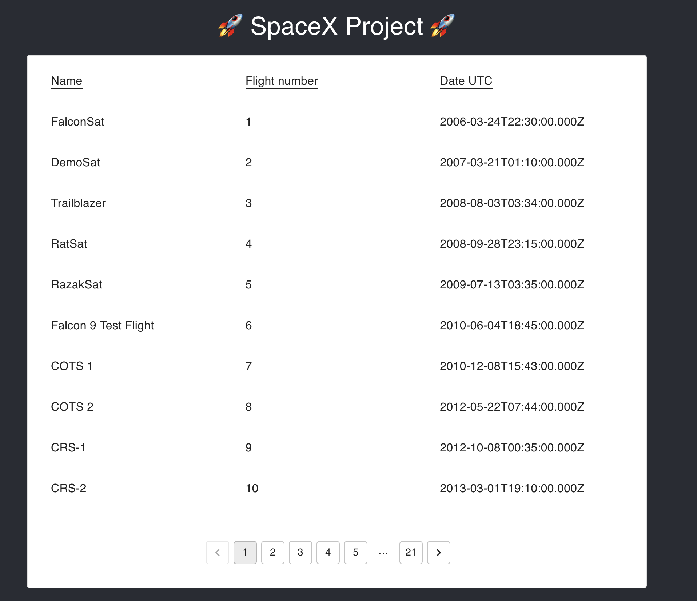
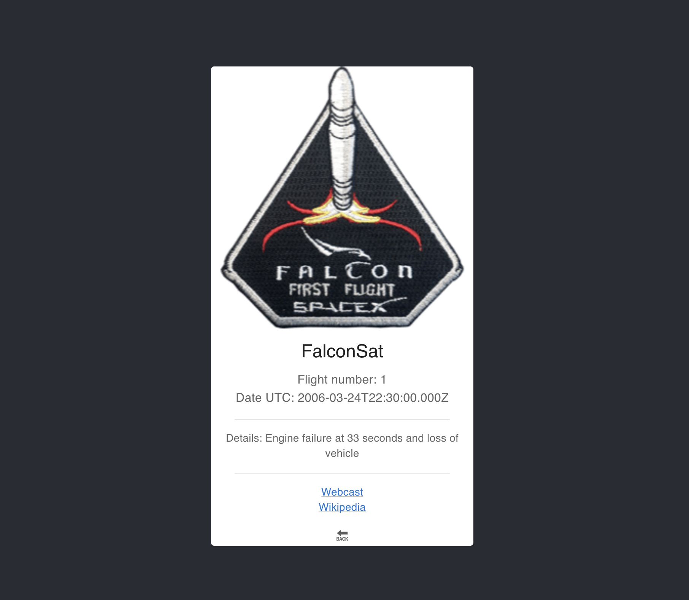

# Project SpaceX

Ce projet vise à créer une application de gestion des lancements SpaceX, offrant des fonctionnalités pour afficher tous les lancements disponibles et obtenir des détails spécifiques pour chaque lancement.

L'application est divisée en un backend construit avec NestJS et GraphQL, qui interagit avec l'API SpaceX, et un frontend utilisant React et Material-UI pour une interface utilisateur conviviale.

Elle offre également des tests unitaires pour s'assurer du bon fonctionnement des services et des resolveurs, ainsi qu'une stratégie de mise en cache personnalisée pour améliorer les performances globales de l'application.

## Installation

Afin d'installer le projet chez vous, voici la suite de commandes à lancer.
En gros, on clone le projet, puis (après avoir donner les droits pour l'excuter), on lance le script de démarrage.

```bash
  git clone https://github.com/jack75015/spacex-project.git
  cd spacex-project
  chmod +x start.sh
  ./start.sh
```

Voici ce qu'on retrouve donc dans ce script `start.sh`:

```bash
#!/bin/bash

# Construction de l'image Docker pour le frontend
cd frontend
docker build -t frontend-image .
cd ..

# Construction de l'image Docker pour le backend
cd backend
docker build -t backend-image .
cd ..

# Démarrage des services avec Docker Compose
docker-compose up
```

Une fois les images construites et les containers lancés, vous pouvez aller dans votre navigateur à l'url suivant: http://localhost:3001/

## Explications

### Caching:

En utilisant le caching, on va pouvoir stocker temporairement des données fréquemment utilisées en mémoire, ce qui réduit le temps nécessaire pour les récupérer à partir de l'API.
J'ai donc utiliser le service de caching proposée par NestJS : https://docs.nestjs.com/techniques/caching

Sauf qu'on nous précise que ça ne marche pas avec GraphQL 🤡 (n GraphQL applications, interceptors are executed separately for each field resolver. Thus, CacheModule (which uses interceptors to cache responses) will not work properly.)

Du coup, je suis partis sur une implem custom d'un middleware: `graphQLCacheMiddleware`.
Dedans, on crée des cacheKeys basées sur les requêtes entrantes GraphQL, on vérifie la présence de données en cache avant de faire une requête au serveur, et on stocke les réponses en cache pour des requêtes ultérieures. Ca réduit ainsi la charge sur le serveur et peut améliorer les performances de l'application.
J'ai mis le TTL à 30sec afin de pouvoir tester.

Pour la partie Frontend avec react, pas de caching particulier hormis celui deja proposé par apollo (https://www.apollographql.com/docs/react/caching/overview/).

### Tests:

Afin de pouvoir éprouver l'application, j'ai decider d'implementer quelques tests. Ceux-ci seront cependant concentrés sur la partie backend du projet. Voici les 3 tets mis en place:

#### Test du service LaunchesService:

Ce test vérifie si le service LaunchesService peut récupérer toutes les données de lancement avec des paramètres par défaut. Il vérifie également si l'appel à l'API externe se fait correctement et gère les erreurs de manière appropriée.

#### Test du resolver LaunchesResolver:

Ce test vérifie si le resolver LaunchesResolver est capable de récupérer toutes les données de lancement avec les paramètres de pagination. Il examine si le service LaunchesService est correctement appelé et s'il retourne les données attendues.

#### Test du resolver LaunchResolver:

Ce test vise à s'assurer que le resolver LaunchResolver est capable de récupérer les détails d'un seul lancement en fonction de son ID. Il vérifie si le service LaunchesService est appelé avec l'ID approprié et renvoie les détails du lancement attendus.

Chacun de ces tests s'appuie sur des assertions pour vérifier les résultats attendus par rapport aux appels de service ou de résolveur. Ils garantissent le bon fonctionnement des fonctionnalités spécifiques de notre application tout en testant la gestion des erreurs et des appels externes.

Pour lancer les tests, merci de suivre ces instructions:

```bash
cd backend
npm install
npm run test
```

Voici le resultat attendu:

```bash
> spacex-project-backend@0.0.1 test
> jest

 PASS  src/launches/tests/launches.service.test.ts
 PASS  src/launches/tests/launches.resolver.test.ts
 PASS  src/launches/tests/launch.resolver.test.ts

Test Suites: 3 passed, 3 total
Tests:       6 passed, 6 total
Snapshots:   0 total
Time:        2.182 s
Ran all test suites.
```

## Screenshots

Vous pouvez également tester les query via le playground graphql: http://localhost:3000/graphql

La liste des lancements:



Un lancement en particulier:


